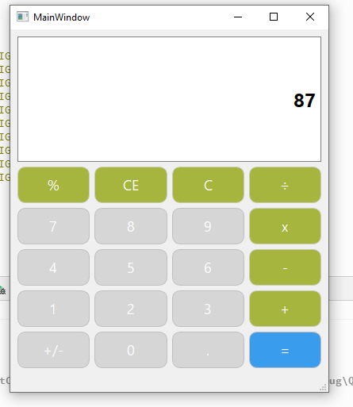

# 🧮 Qt Calculator

A simple and elegant calculator application built using **Qt (C++)**.  
This project demonstrates GUI design, event handling, and basic expression handling in Qt.

---

## 🚀 Features

- 🔢 Basic arithmetic operations:
  - Addition (+)
  - Subtraction (-)
  - Multiplication (*)
  - Division (/)

- 🟡 Decimal number support (.)
- 🔴 Clear button (C)
- 🟢 Real-time display update
- 📱 Clean and responsive UI design
- 🎯 Button-based input (no keyboard required)

---

## 🖥️ UI Preview

---

## 🛠️ Technologies Used

- **C++**
- **Qt Widgets**
- **Qt Designer**
- **Qt Style Sheets (QSS)**

---

## 🚧 Project Status

This project is still **ongoing** and under active development.  
Some features are incomplete and will be added in future updates.

